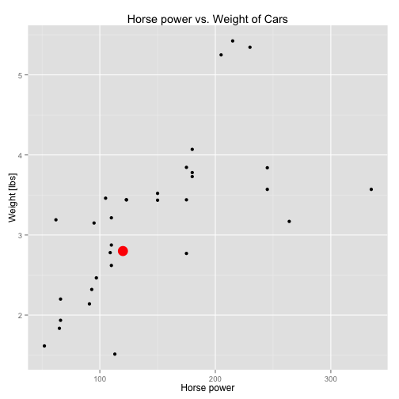

## Introduction

* The `mtcars` dataset is used
* Task: using a logistic regression to determine the probability if a car fits the model
* Parameter used for the model: horse power (hp) and weight (wt)

---

## Graphical user interface (Shiny app)

* User input: horse power (hp) and weight (wt)
* Output: A probabilty if a car fits the model
* Graph output: The point of the user's input

---

## Graphical user interface (con't)



---

## Model

* Using a generalized linear model of the binomial family


```r
glm <- glm(data=mtcars, formula=am ~ hp + wt, family=binomial(link="logit"))
```

* Predict a value


```r
newdata <- data.frame(hp=120, wt=2.8) # hp=horse power, wt=weight [lbs/1000]
predict(glm, newdata, type="response")
```

```
##         1 
## 0.6418125
```

* Result

The probability of the car (horse power 120, weight 2800 lbs) being fitted with a manual transmission is about **64.18%**.
